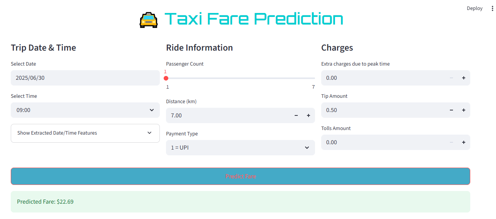

# 🚖 Taxi Fare Prediction App

A user-friendly **Streamlit web app** to predict taxi fares based on trip details like date/time, distance, passenger count, and charges. This project demonstrates how machine learning can be deployed in real-world scenarios with a clean and responsive UI.



---

## 🔍 Project Overview

This project uses a machine learning model (e.g., XGBoost Regressor) trained on historical taxi trip data to estimate the total fare amount for a ride. It includes several input fields and feature transformations under the hood to improve prediction accuracy.

---

## 🧠 Features

- 📅 Intelligent date and time extraction (day of week, AM/PM, night ride, hour)
- 👥 Passenger count selector (1–7)
- 📏 Distance input with automatic log transformation
- 💳 Payment type selection
- 💰 Additional charges inputs (extra, tip, tolls)
- 🚀 Fast fare prediction using a pre-trained model
- 🎨 Custom styled Streamlit layout with wide page support

---

## 🛠️ How It Works

1. **User Input:**  
   The user enters ride details like date, time, number of passengers, distance, and charges.

2. **Feature Engineering:**  
   Features such as:
   - `day_of_week`
   - `hour`
   - `am_pm`
   - `is_night`
   - Log-transformed `distance_km`  
   are extracted or transformed in real-time.

3. **Prediction:**  
   The inputs are passed to a pre-trained machine learning model (stored as `best_model.pkl`) and the predicted fare is displayed.

---

## 📦 Tech Stack

- **Python**
- **Streamlit** – for building the interactive web interface
- **Pandas & NumPy** – for data handling and transformation
- **Scikit-learn / XGBoost** – for model training
- **Pickle** – for saving/loading the model

---

## 📸 App Interface


---

## ▶️ Run Locally

To run this project locally:

```bash
# 1. Clone the repository
git clone https://github.com/VijayRakkaiah/TripFare_Predicting_Urban_Taxi_Fare.git
cd taxi-fare-prediction

# 2. Create a virtual environment (optional but recommended)
python -m venv .venv
venv\Scripts\activate

# 3. Install dependencies
pip install -r requirements.txt

# 4. Run the app
streamlit run app.py
